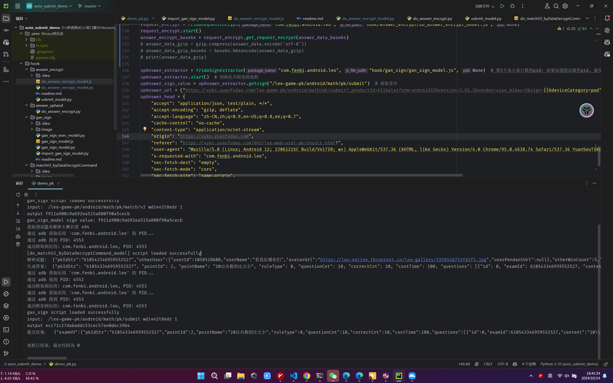

# 自动刷题目录
纯协议小猿口算实现模板 (正在加密答案)

# 现状
已实现纯协议答题模板

~~已经逆向答案加密, 准备实现中 [加密答案分析](../anay_answerEncrypt.js)~~

~~尝试逆向 [前端试题请求逆向](前端试题请求逆向.md)~~

# 计划步骤
[✔] 1. 我们需要写一个发包脚本, 使用`gan_sign`生成`sign`值, 向`https://xyks.yuanfudao.com/leo-game-pk/android/math/pk/match/v2?pointId=2&_productId=611&platform=android32&version=3.93.2&vendor=xiao_mi&av=5&sign=0e40a461631880b0937515fd93fe87b6&deviceCategory=pad`发起post

[✔] 2. 我们需要修改[do_matchV2_byDataDecryptCommand_model.js](../matchV2_byDataDecryptCommand/do_matchV2_byDataDecryptCommand_model.js), 使其加载并解密上一步收到的试题包

[✔] 3. 我们需要研究收到的试题包和待提交的答案包的json对应关系, 根据对应关系生成待提交的答案包

[✔] 4. 我们需要修改[submit](../submit), 使其能够接收我们生成的答案包, 将答案包加密成服务器认可的二进制格式

[✔] 5. 向`https://xyks.yuanfudao.com/leo-game-pk/android/math/pk/submit?_productId=611&platform=android32&version=3.93.2&vendor=xiao_mi&av=5&sign=47d140c9a28f4d0343dfb9f109c93b2e&deviceCategory=pad`发包

[✘] 6. 根据get_cookie.js文件，修改后可获得相应Cookie，将其传入demo_pk.py的几个部分即可实现全协议结算作答。

这里每一步都是巨坑

# 回顾
- 解试题包加密  
  [matchV2](../matchV2) 于2024年10月11日(五)傍晚完成  
  [matchV2_byDataDecryptCommand](../matchV2_byDataDecryptCommand) 于2024年10月12日(六)下午15时完成  

- 解sign  
  [gan_sign](../gan_sign) 于2024年10月12日(六)凌晨2时完成  

- 解提交包  
  [submit](../submit) 于2024年10月13日(日)凌晨1时完成

# 佬们，要写不完了，我周一周二满课
