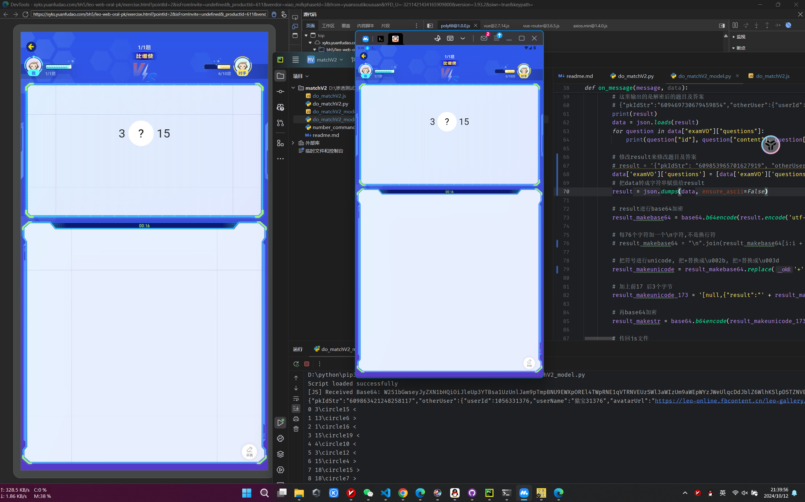

# 演示通过frida拿pk试题明文
[视频演示](/video/frida_matchV2.mp4)

|文件名|功能|
|--|--|
|do_matchV2_model.js|模型, hook获取pk试题|
|do_matchV2_model.py|模型, 调用do_matchV2_model.js获取pk试题|
|do_matchV2.js|模型, hook获取pk试题|
|do_matchV2.py|由[@x781078959](https://github.com/x781078959)实现自动脚本|
|number_command.py|由[@x781078959](https://github.com/x781078959)实现自动脚本|

