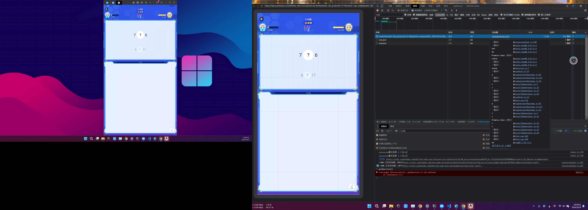
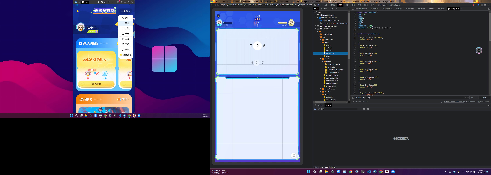
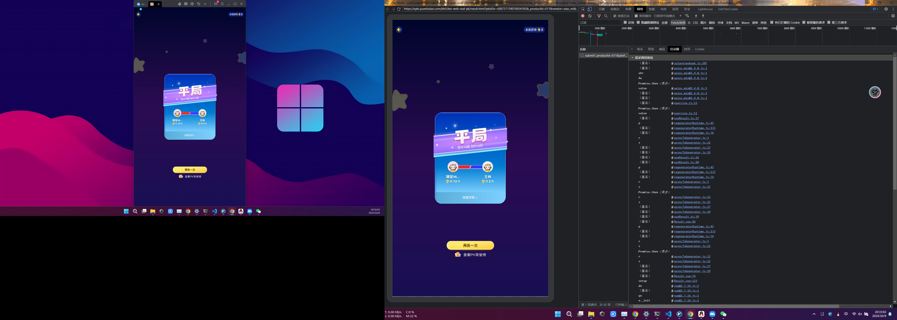

# 小猿口算逆向笔记

- proxypin抓包
经过抓包分析，其中https://xyks.yuanfudao.com/leo-game-pk/android/math/pk/match为本次pk试题及答案，  
但是提交答案的https://xyks.yuanfudao.com/leo-game-pk/android/math/pk/submit接口被加密了，我们无法直接提交答案。   

- [anay_reqMethod.js](anay_reqMethod.js)hook常见请求库  
准备hook `okhttp3` `java.net.HttpURLConnection` `java.net.URL` 三个常见请求库，发现捕获到的所有请求均来自`java.net.URL`

- [anay_reqMethod.js](anay_reqMethod.js)专门针对`java.net.URL`进行hook  
发现能获取到数据包，但是不全，需要的pk试题数据包不在这里

- 思考  
小猿口算的各类功能是实时vue网页，小猿口算本身仅有极少功能使用`java.net.URL`发一点点包，其余均为vue网页

- [anay_webview.js](anay_webview.js)  
。。。。  
hook白搭，lsposed上算法助手，强开webview调试，chrome浏览器打开`chrome://inspect`,小猿口算打开ps界面，然后回chrome调试，这里有个小技巧，每个页面第一个进入调试是抓不全的，chrome调试窗口里保留日志刷新一下即可。

# chrome调试

## 获取pk试题及答案
https://xyks.yuanfudao.com/leo-game-pk/android/math/pk/match?pointId=2&_productId=611&platform=android32&version=3.93.2&vendor=xiao_mi&av=5&sign=027891f181b738b3f8abe81c7ee49dda&deviceCategory=pad 是获取pk试题及答案链接  
查看一下match请求的调用链  
  
一点小技巧，axios是三方请求库，一般看这类三方库是没用的，找axios的上一级，也就是`exercise.ts:7`   
``` javascript
import { IExamVO, IExerciseQuestionVO, IOralPkExerciseVO, IOralPkResultVO } from '@/types/exercise/exercise'
import request from '@/services/request'
import { encryptRequestBody } from '@/utils/EncryptData'

export default class ExerciseService {
  static getPkExerciseQuestion (pointId: string): Promise<IOralPkExerciseVO> {
    return request.post(`/leo-game-pk/{client}/math/pk/match?pointId=${pointId}`, null).then(res => res.data)
  }

  static postPkExerciseResult (exerciseData: any): Promise<IOralPkResultVO> {
    return encryptRequestBody(exerciseData).then(encryptedData => {
      return request.put('/leo-game-pk/{client}/math/pk/submit', encryptedData, {
        headers: { 'content-type': 'application/octet-stream' }
      }).then(res => res.data)
    })
  }

  static getPkExerciseResult (pkIdStr: string): Promise<IExamVO> {
    return request.get(`/leo-game-pk/{client}/math/pk/history/detail?pkIdStr=${pkIdStr}`).then(res => res.data)
  }
}
```
看起来也没什么用，再向上找一级，也就是`useOral.ts:27`  
```javascript
const getQuestion = async () => {
  reset()
  const query: any = QueryUtil.search() // 把url的参数拆成了数组{pointId: '2', _productId: '611', vendor: 'xiao_mi', phaseId: '3', from: 'yuansoutikousuan', …}
  const { pointId } = query
  const res = await ExerciseService.getPkExerciseQuestion(pointId) // pointId=2
  questionList.value = (res.examVO.questions as IOralQuestion[]) || []
  formatQuestionList.value = preprocessQuestion(res.examVO.questions)
  questionVO.value = res
}

const frogParams = computed(() => {
  return {
    pkid: questionVO.value?.pkIdStr || '',
    pointid: questionVO.value?.examVO?.pointId || 0
  }
})

const useOral = () => ({
  questionVO,
  questionIndex,
  questionList,
  formatQuestionList,
  errorQuestion,
  frogParams,
  showUserAvatar,
  getQuestion
})

export default useOral
```
由上代码发现方法名是getQuestion, 包装在useOral里对外提供  
再向上找一层,也就是`Oral.vue:178`
```js
const init = async () => {
  getExerciseMotivation()
  if (isIOS()) {
    runUniqueApi('setBounceEnable', {
      enable: false
    }, 'leo')
  }
  showLoadingView()
  autoGotoTimeOverPage()
  const query = getQuery()
  ruleType.value = query.ruleType
  try {
    await fetchUserInfo()
    setVisibleChange()
    await getQuestion()
    await waitImageLoaded([
      require('@/assets/exercise/matching/matching-top.png'),
      require('@/assets/exercise/matching/matching-bottom.png')
    ], 3000)
    matchingRef.value?.startPlay()
    await nextTick()
    hideLoadingView()
  } catch (e) { // 未登录用户引导去登录
    console.log(e)
    $addFrog('/debug/oralPk/exercise/netError', {
      exception: e
    })
    showLoadingErrorView({
      trigger: async () => {
        try {
          $addFrog('/debug/oralPk/exercise/retry')
          await login({})
          init()
        } catch (e) {
          hideLoadingView()
          closeWebView()
        }
      }
    })
  }
}

```
看起来也没什么用， 但是搜索试题方法调用了`QueryUtil.js`
```js
export default {
  search () {
    const result = {}
    const query = window.location.search.substr(1) // 也就是url的参数'pointId=2&_productId=611&vendor=xiao_mi&phaseId=3&from=yuansoutikousuan&YFD_U=-3211421434165909800&version=3.93.2&siwr=true&keypath='
    const [, tailQuery] = window.location.hash.split('?')
    const queriesToParse = tailQuery ? [tailQuery, query] : [query]
    queriesToParse.forEach((query) => {
      query.split('&').forEach((part) => {
        const item = part.split('=')
        result[item[0]] = decodeURIComponent(item[1])
      })
    })
    return result
  },// 执行下来只是变了格式 {pointId: '2', _productId: '611', vendor: 'xiao_mi', phaseId: '3', from: 'yuansoutikousuan', …}
  params2query (params) {
    const paramsList = []
    Object.keys(params).forEach(key => {
      if (key && params[key]) {
        paramsList.push(`${key}=${params[key]}`)
      }
    })
    if (paramsList.length) {
      return `?${paramsList.join('&')}`
    } else {
      return ''
    }
  }
}
```
`exercise.ts`
```js
import { IExamVO, IExerciseQuestionVO, IOralPkExerciseVO, IOralPkResultVO } from '@/types/exercise/exercise'
import request from '@/services/request'
import { encryptRequestBody } from '@/utils/EncryptData'

export default class ExerciseService {//client=android, pointId=url参数里的pointId，为2
  static getPkExerciseQuestion (pointId: string): Promise<IOralPkExerciseVO> {
    return request.post(`/leo-game-pk/{client}/math/pk/match?pointId=${pointId}`, null).then(res => res.data)
  }

  static postPkExerciseResult (exerciseData: any): Promise<IOralPkResultVO> {
    return encryptRequestBody(exerciseData).then(encryptedData => {
      return request.put('/leo-game-pk/{client}/math/pk/submit', encryptedData, {
        headers: { 'content-type': 'application/octet-stream' }
      }).then(res => res.data)
    })
  }

  static getPkExerciseResult (pkIdStr: string): Promise<IExamVO> {
    return request.get(`/leo-game-pk/{client}/math/pk/history/detail?pkIdStr=${pkIdStr}`).then(res => res.data)
  }
}
```
到头了,如此看来,就是加载页面初始化时调用useOral里的getQuestion获取pk试题及答案, 但是`exercise.ts:7`只加了`pointId`一个参数,其他请求头的参数怎么生成呢? 
仔细观察,发现`exercise.ts:7`用的`@/services/request`下的`request.post`方法  
查看`@/services/request`  
```js
import { isOnline, getAppVersion, greaterThanOrEqualTo } from '@/utils/Utils'
import axios, { AxiosError, AxiosInstance, AxiosRequestConfig, AxiosResponse } from 'axios'
import Config from '@/config'
import { throttle } from 'lodash-es'
import { runUniqueApi } from '@solar/webview'
import { isYuanKouSuan, NetworkUtil } from '@solar/common-utils'

const showToast = throttle((msg) => {
  window.VUE_APP && window.VUE_APP.showToast && window.VUE_APP.showToast(msg)
}, 1000, { trailing: false })

/**
 * isYuanKouSuan：
  在webpack://leo-web-oral-pk/node_modules/@solar/common-utils/lib/utils/DeviceUtil.js里有写，仅仅是检查UA里有没有YuanSouTiKouSuan指定字符
  export var isYuanKouSuan = function () { return testUa('YuanSouTiKouSuan'); };

 * runUniqueApi：
 在webpack://leo-web-oral-pk/node_modules/@solar/webview/lib/index.js
 name=requestConfig, params=object:"/leo-game-pk/{client}/math/pk/match?pointId=2", namespace=LeoSecure
  export var runUniqueApi = function (name, params, namespace) { 
      if (namespace === void 0) { namespace = ''; }
      if (params.callback) {
          params.trigger = params.callback;
      }
      execWithCallback(name, {
          V0: V0,
          oldValidParams: {
              params: params
          }
      }, name, namespace);
  };
 * 
 详见 `detail_requestConfig.md`
 */
export const signUrlIfNeeded = (url: string) => { // 大概和请求头参数的sign相关
  return new Promise<string>(resolve => {
    if (isYuanKouSuan() && greaterThanOrEqualTo('3.42.0') && (url.indexOf('{device}') !== -1 || url.indexOf('{client}') !== -1)) {
      // 调用函数名requestConfig, 传递参数path:url, 有错误返回url, 没错误返回执行结果res.wrappedUrl
      /* requestConfig调试到这里: (window.requestConfig_callback_1728546427344_13 && window.requestConfig_callback_1728546427344_13("W251bGxd"))
      解码W251bGxd为[null]
      */
      runUniqueApi('requestConfig', {
        path: url,
        trigger: (err: any, res: any) => {
          if (err && err !== 0) {
            resolve(url)
          } else {
            resolve(res.wrappedUrl)
          }
        }
      }, 'LeoSecure')
    } else {
      if (url.indexOf('{device}') !== -1 || url.indexOf('{client}') !== -1) {
        const resultUrl = url.replace('{device}', 'api').replace('{client}', 'api')
        resolve(resultUrl)
      } else {
        resolve(url)
      }
    }
  })
}

const initAxiosInstanceRequest = (instance: AxiosInstance) => {
  instance.interceptors.request.use(async (config: AxiosRequestConfig) => {
    if (!isOnline()) {
      showToast('天了噜，你的网络罢工了。')
    }
    const wrappedUrl = await signUrlIfNeeded(config.url || '')
    if (wrappedUrl.indexOf('_productId') === -1) {
      const params = {
        _productId: Config.productId,
        _appId: Config.appId,
        version: getAppVersion()
      }
      config.params = { ...config.params, ...params }
    }
    config.url = wrappedUrl
    return config
  }, (error: any) => {
    return Promise.reject(error)
  })
}

const initAxiosInstanceResponse = (instance: AxiosInstance) => {
  instance.interceptors.response.use((res: AxiosResponse) => {
    return res
  }, async (err: AxiosError) => {
    if (err.response && err.response.status >= 500) {
      showToast('小猿出故障惹，正在修复，等会儿嗷')
    }
    const networkFailed4xxManage = await NetworkUtil.networkManageFor4xx(instance, err)
    if (networkFailed4xxManage) {
      return networkFailed4xxManage
    }
    if (err.response && err.response.status === 418) {
      showToast(err.response.data.message || '服务器升级中，请稍后使用')
    }
    throw err
  })
}

const getSolarHost = () => {
  return Config.LEO_HOST
}

const instance = axios.create({
  withCredentials: true,
  baseURL: `${getSolarHost()}/`
})

initAxiosInstanceRequest(instance)
initAxiosInstanceResponse(instance)

export default instance

```
**对于上面的requestConfig，详见[detail_requestConfig.md](detail_requestConfig.md)**
## 彩蛋, 巅峰对决是大学专场, `webpack://leo-web-oral-pk/./src/config/pk-config.ts`注释如是说
```js
export enum GradeEnum {
  ONE = 1,
  TWO,
  THREE,
  FOUR,
  FIVE,
  SIX,
  PRESCHOOL = 100,
  UNIVERSITY = 13, // 大学专场-巅峰对决
}

export const gradeMap = [
  {
    key: GradeEnum.PRESCHOOL,
    name: '学龄前'
  },
  {
    key: GradeEnum.ONE,
    name: '一年级'
  },
  {
    key: GradeEnum.TWO,
    name: '二年级'
  },
  {
    key: GradeEnum.THREE,
    name: '三年级'
  },
  {
    key: GradeEnum.FOUR,
    name: '四年级'
  },
  {
    key: GradeEnum.FIVE,
    name: '五年级'
  },
  {
    key: GradeEnum.SIX,
    name: '六年级'
  },
  {
    key: GradeEnum.UNIVERSITY,
    name: '巅峰对决'
  }
]
```



## 生成待提交答案数据
找到`https://xyks.yuanfudao.com/leo-game-pk/android/math/pk/submit?_productId=611&platform=android32&version=3.93.2&vendor=xiao_mi&av=5&sign=185168051d5f7f3e0b64af0c66691737&deviceCategory=pad`,查看调用链
  
+ useLocalResult.ts
获取本地考试结果  
`useResult.ts:98` -> `uploadExam` -> `exerciseResult` -> `getLocalResultWithRetry` -> `useLocalResult` -> `getLocalResult` -> `getLocalResult`
```js
const getLocalResult = (): IExamVO | null => {
  try {
    const resultDataString = StorageUtil.getItemWithException('exerciseResult')
    if (!resultDataString) {
      console.log('getLocalResult', 'no data')
      return null
    }
    console.log('getLocalResult', resultDataString)
    return JSON.parse(resultDataString)
  } catch (e) {
    addFrog({
      url: '/debug/oralPK/getLocalResultError',
      params: {
        exception: e
      },
      flushFrog: false
    })
    return null
  }
}

```
+ Result.vue
```js
<template>
  <div class="result">
    
    <Navbar :title="title" :show-gems="!isFromHistory()" :gems="currentGems" @onBack="onBackClick" @onRight="onGemsClick" />
    <ResultHeader v-if="!showPkResult" />
    <ResultContentWrapper style="flex: 1;overflow: hidden;" />

    <div class="bottom-bar-replacer"></div>
    <div class="bottom-bar" @click="onBackClick">
      返回
    </div>

    <PkResultModel :style="{ zIndex: showPkResult ? '1' : '-1' }" />
    <GemsModel v-if="showGemsModel" />
    <EncourageModel v-if="showEncourageModel" />
  </div>
</template>

<script setup lang="ts">
import Navbar from '@/components/exercise/components/Navbar.vue'
import ResultHeader from '@/components/result/components/ResultHeader.vue'
import ResultContentWrapper from '@/components/result/components/ResultContentWrapper.vue'
import useResult from '@/hooks/useResult'
import PkResultModel from '@/components/result/components/PkResultModel.vue'
import Vue, { computed, nextTick, onMounted } from 'vue'
import { closeWebView, hideLoadingView, runUniqueApi, showLoadingErrorView } from '@solar/webview'
import GemsModel from '@/components/result/components/GemsModel.vue'
import { isIOS } from '@/utils/Utils'
import { LeoBroadcastChannel } from '@solar/leo-web-broadcast-channel'
import useMotivation from '@/hooks/useMotivation'
import EncourageModel from '@/components/result/components/EncourageModel.vue'

const { showPkResult, showGemsModel, showEncourageModel, currentGems, frogParam, fetchUserInfo, loadData, isFromHistory } = useResult()
const { getExerciseMotivation, exerciseMotivation, toFusionClockIn, setCloseAction } = useMotivation()
const { $addFrog } = Vue.prototype

const pkChannel = new LeoBroadcastChannel('motivation-pk')

const title = computed(() => {
  if (!showPkResult.value) {
    return '答题详情'
  } else {
    return ''
  }
})

const onBackClick = () => {
  if (!showPkResult.value && !isFromHistory()) {
    showPkResult.value = true
  } else {
    if (exerciseMotivation.value) {
      toFusionClockIn()
      return
    }
    closeWebView()
  }
}

const onGemsClick = () => {
  // const rankUrl = `${location.origin}/bh5/leo-web-oral-pk/pk.html#/pk-record`
  // openSchema({
  //   schemas: [`native://openWebView?url=${encodeURIComponent(rankUrl)}&hideNavigation=true&immerseStatusBar=true&autoHideLoading=true&targetModule=mathExercise`],
  //   trigger (err) {
  //     if (err) {
  //       console.log('打开native链接失败', rankUrl)
  //     }
  //   },
  //   close: false
  // })
}

onMounted(() => {
  $addFrog('/debug/oralPk/result/onMounted')
})

const init = async () => {
  try {
    pkChannel.addOnMessageListener('exercise_motivation_back_pk', async (params) => {
      try {
        const { curExp = 0 } = JSON.parse(params)
        currentGems.value = curExp
      } catch (error) {
      }
    })
    await getExerciseMotivation()
    setCloseAction()
    if (isIOS()) {
      runUniqueApi('setBounceEnable', {
        enable: false
      }, 'leo')
    }
    if (exerciseMotivation.value && !isFromHistory()) {
      // const { lastExp, rankVersion } = await getLastData() || {}
      // gotoHonorRoll('oralPkResult', lastExp, rankVersion)
    }
    await Promise.all([fetchUserInfo(), loadData()])
    console.log('!isFromHistory():', !isFromHistory())
    if (!isFromHistory()) {
      showPkResult.value = true
      $addFrog('/event/calculatePage/onlinePKResult/enter', frogParam.value)
      await nextTick()
      if (!exerciseMotivation.value) {
        setTimeout(() => {
          showGemsModel.value = true
        }, 3000)
      }
    }
    hideLoadingView()
  } catch (e) {
    console.log(e)
    $addFrog('/debug/oralPk/result/netError', {
      exception: e
    })
    showLoadingErrorView({
      trigger: () => {
        $addFrog('/debug/oralPk/result/errorRetry')
        init()
      }
    })
  }
}

init()
</script>
```
+ useResult.ts  
```js
import useLocalResult from '@/hooks/useLocalResult'
import { IExerciseQuestionVO, IOralPkResultVO, IOralQuestion } from '@/types/exercise/exercise'
import ExerciseService from '@/services/exercise'
import Vue, { computed, nextTick, ref } from 'vue'
import { IQuestionImg } from '@/types/result/result'
import { drawOralExercise } from '@/utils/QuestionItemUtils'
import { useUserInfo } from '@/hooks/useUserInfo'
import QueryUtil from '@/utils/QueryUtil'
import { addFrog, closeWebView } from '@solar/webview'
import StorageUtil from '@/utils/StorageUtil'
import useMotivation from './useMotivation'

const { getLocalResultWithRetry, clearLocalResult } = useLocalResult()
const { fetchUserInfo } = useUserInfo()
const { exerciseMotivation } = useMotivation()

const STORAGE_KEY_LAST_PK_ID = 'STORAGE_KEY_LAST_PK_ID'

const record = ref<IOralPkResultVO>()
const questionImgList = ref<IQuestionImg[]>([])
const showPkResult = ref(false)
const showGemsModel = ref(false)
const showEncourageModel = ref(false)
const currentGems = ref(0)

const uploadExam = async (record: IExerciseQuestionVO): Promise<IOralPkResultVO | null> => {
  return await ExerciseService.postPkExerciseResult(record)
}

const drawOral = (record: IOralPkResultVO) => {
  questionImgList.value = drawOralExercise((record.examVO.questions || []) as IOralQuestion[], true)
}

const isFromHistory = (): any => {
  const query: any = QueryUtil.search()
  return query.isFromHistory
}

const loadData = async () => {
  if (isFromHistory()) {
    const query: any = QueryUtil.search()
    const { pkIdStr } = query
    const result = await ExerciseService.getPkExerciseResult(pkIdStr)
    record.value = {
      capacity: 0,
      otherUser: null,
      otherWinCount: 0,
      pkResult: 0,
      selfWinCount: 0,
      taskScore: 0,
      examVO: result,
      totalCapacity: 0,
      targetCostTime: 0,
      rankCapacity: 0
    }
    drawOral(record.value)
  } else {
    const query: any = QueryUtil.search()
    const { pkIdStr } = query
    const exerciseResult = await getLocalResultWithRetry(3, 1000)
    if (!exerciseResult) {
      const lastPkId = StorageUtil.getItem(STORAGE_KEY_LAST_PK_ID)
      addFrog({
        url: '/debug/oralPK/emptyLocalResult',
        params: {
          pkIdStr: pkIdStr,
          lastPkId: lastPkId,
          isSameAsLastPkId: pkIdStr === lastPkId ?? 'false'
        },
        flushFrog: false
      })
      closeWebView()
      return
    }
    addFrog({
      url: '/debug/oralPK/postResultData',
      params: {
        pkIdString: exerciseResult.pkIdStr,
        costTime: exerciseResult.costTime,
        pointName: exerciseResult.pointName,
        pointId: exerciseResult.pointId,
        updatedTime: exerciseResult.updatedTime
      },
      flushFrog: false
    })
    if (pkIdStr !== exerciseResult.pkIdStr) {
      addFrog({
        url: '/debug/oralPK/misMatchedPkId',
        params: {
          queryPkId: pkIdStr,
          localStoragePkId: exerciseResult.pkIdStr
        },
        flushFrog: false
      })
      closeWebView()
      return
    }
    const result = await uploadExam(exerciseResult)
    if (result) {
      clearLocalResult()
      StorageUtil.setItem(STORAGE_KEY_LAST_PK_ID, exerciseResult.pkIdStr)
      addFrog({
        url: '/debug/oralPK/postResultSuccess',
        params: {
          pkIdString: exerciseResult.pkIdStr,
          costTime: exerciseResult.costTime,
          pointName: exerciseResult.pointName,
          pointId: exerciseResult.pointId,
          updatedTime: exerciseResult.updatedTime
        },
        flushFrog: false
      })
      record.value = result
      if (!exerciseMotivation.value) {
        currentGems.value = result.rankCapacity - result.capacity
      }
      drawOral(record.value)
    }
  }
}

const frogParam = computed(() => {
  return {
    pkid: record.value?.examVO?.pkIdStr,
    pointid: record.value?.examVO?.pointId,
    result: record.value?.pkResult
  }
})

const useResult = () => ({
  questionImgList,
  record,
  showPkResult,
  showGemsModel,
  showEncourageModel,
  currentGems,
  frogParam,
  fetchUserInfo,
  loadData,
  isFromHistory
})

export default useResult

```


## 太麻烦了,直接读数据模拟用户操作吧
小猿口算用的vue2.7.14  
全局安装[独立vue调试工具](https://devtools.vuejs.org/guide/standalone)
```
npm add -g @vue/devtools@next
```
在已打开的页面加载vue-devtools
```
const script = document.createElement('script');
script.src = 'http://localhost:8098';
document.head.appendChild(script);
```
```js
const divs = document.querySelectorAll("#primary-question-wrap > div");
const lastDiv = divs[divs.length - 1];
lastDiv.style.visibility = 'visible';
const num = lastDiv.innerText.split(' \n ').map(Number);
console.log(num);
const canvas = document.querySelector("body > div > canvas");
const ctx = canvas.getContext("2d");
ctx.beginPath();
const difference = num[1] - num[0];
if (difference > 0) {
    console.log(">");
    ctx.moveTo(100, 100);
    ctx.lineTo(200, 150);
    ctx.lineTo(100, 200);
    const mouseDownEvent = new MouseEvent('mousedown', {
        bubbles: true,
        cancelable: true,
        clientX: 100,
        clientY: 100,
    })
    const mouseMoveEvent = new MouseEvent('mousemove', {
        bubbles: true,
        cancelable: true,
        clientX: 200,
        clientY: 150,
    })
    const mouseUpEvent = new MouseEvent('mouseup', {
        bubbles: true,
        cancelable: true,
        clientX: 100,
        clientY: 200,
    })
    canvas.dispatchEvent(mouseDownEvent)
    canvas.dispatchEvent(mouseMoveEvent)
    canvas.dispatchEvent(mouseUpEvent)
} else if (difference === 0) {
    console.log("=");
    ctx.moveTo(100, 100);
    ctx.lineTo(100, 200);
    ctx.moveTo(200, 100);
    ctx.lineTo(200, 200);
    const mouseDownEvent1 = new MouseEvent('mousedown', {
        bubbles: true,
        cancelable: true,
        clientX: 100,
        clientY: 100,
    })
    const mouseMoveEvent1 = new MouseEvent('mousemove', {
        bubbles: true,
        cancelable: true,
        clientX: 200,
        clientY: 200,
    })
    const mouseUpEvent1 = new MouseEvent('mouseup', {
        bubbles: true,
        cancelable: true,
        clientX: 200,
        clientY: 200,
    })
    const mouseDownEvent2 = new MouseEvent('mousedown', {
        bubbles: true,
        cancelable: true,
        clientX: 200,
        clientY: 200,
    })
    const mouseMoveEvent2 = new MouseEvent('mousemove', {
        bubbles: true,
        cancelable: true,
        clientX: 100,
        clientY: 100,
    })
    const mouseUpEvent2 = new MouseEvent('mouseup', {
        bubbles: true,
        cancelable: true,
        clientX: 100,
        clientY: 100,
    })
    canvas.dispatchEvent(mouseDownEvent1)
    canvas.dispatchEvent(mouseMoveEvent1)
    canvas.dispatchEvent(mouseUpEvent1)
    canvas.dispatchEvent(mouseDownEvent2)
    canvas.dispatchEvent(mouseMoveEvent2)
    canvas.dispatchEvent(mouseUpEvent2)
} else {
    console.log("<");
    ctx.moveTo(200, 100);
    ctx.lineTo(100, 150);
    ctx.lineTo(200, 200);
    const mouseDownEvent = new MouseEvent('mousedown', {
        bubbles: true,
        cancelable: true,
        clientX: 200,
        clientY: 200,
    })
    const mouseMoveEvent = new MouseEvent('mousemove', {
        bubbles: true,
        cancelable: true,
        clientX: 100,
        clientY: 150,
    })
    const mouseUpEvent = new MouseEvent('mouseup', {
        bubbles: true,
        cancelable: true,
        clientX: 200,
        clientY: 100,
    })
    canvas.dispatchEvent(mouseDownEvent)
    canvas.dispatchEvent(mouseMoveEvent)
    canvas.dispatchEvent(mouseUpEvent)
}
ctx.stroke();
```